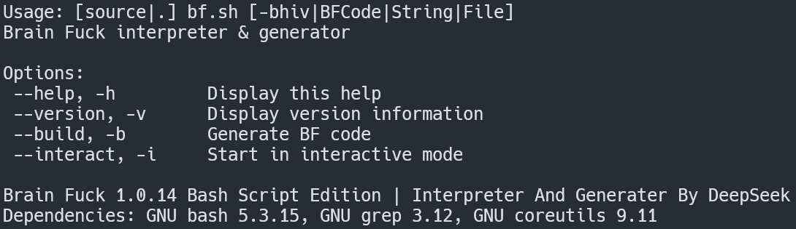
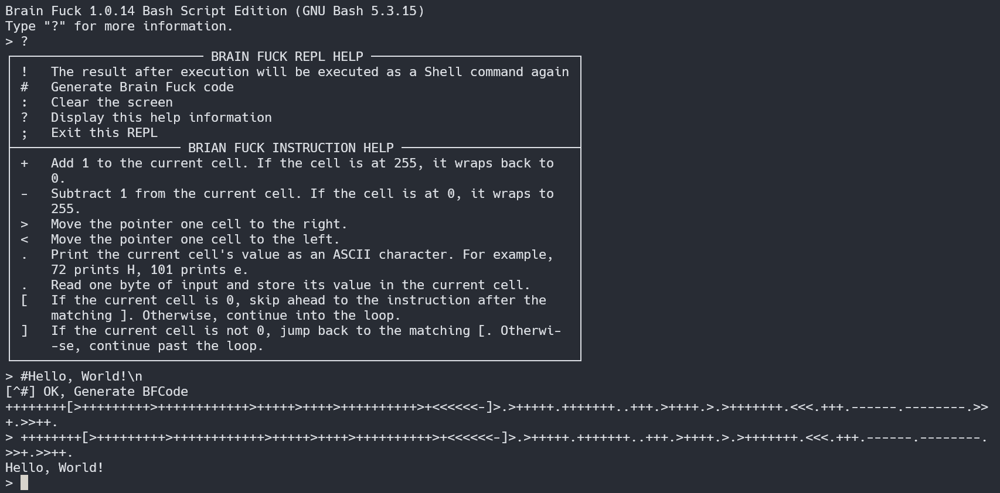

# Brainfuck 解释器与代码生成器（Bash 版）

[ [English Version](README.md) | 简体中文 ]




一个**纯 Bash** 实现的经典 [Brainfuck](https://en.wikipedia.org/wiki/Brainfuck) 语言工具集，包含：

- 完全兼容的解释器：支持 **8 位回绕单元**、**双向无界磁带**和正确的括号匹配。
- **Brainfuck 代码生成器**：将任意 ASCII 字符串编译为紧凑的 BF 程序。
- **交互式 REPL**：提供特殊命令，方便测试和脚本化使用。
- 命令行选项：支持执行代码字符串/文件、生成代码、查看版本等。

解释器遵循 Urban Müller 在 1993 年定义的原始语义，包括 `,` 在 EOF 时置 0，以及 `+`/`-` 在 255 处回绕。

---

## 功能特性

- **标准 8 条指令**：`> < + - . , [ ]` – 与原版完全一致。
- **磁带**：按需双向扩展（每次 128 个单元），无固定上限。
- **单元大小**：8 位无符号整数，模 256 回绕。
- **I/O**：从 `stdin` 读取字节，向 `stdout` 输出字节（ASCII）。
- **错误处理**：检测不匹配的方括号和无效指令。
- **代码生成器**：为给定字符串生成 BF 程序（采用基于块的初始化策略，以减小代码体积）。
- **交互式 REPL**：可执行 BF 代码、生成程序、从输出中运行 Shell 命令等。
- **多语言支持**：根据环境变量 `LANG` 自动显示英文或中文提示信息。

---

## 安装

直接下载脚本并赋予执行权限（或 source 使用）：

```bash
curl -O- https://raw.githubusercontent.com/hornleaf/brainfuck-shell/main/bf.sh | install -m 755 /dev/stdin /usr/bin/bf
```

若要在自己的脚本中使用 `brainfuck` 和 `brainfuck-generate` 函数，可以 source 该文件：

```bash
source bf
```

---

## 使用方法

### 1. 解释器

`brainfuck` 函数（或脚本）支持三种方式传入代码：

```bash
# 从标准输入读取（交互式输入，Ctrl‑D 结束）
brainfuck

# 直接传递包含 BF 代码的字符串
brainfuck "++++++++++[>++++++++++>++++++++++++>++++++++++<<<-]>+.>.>---.<<++++++++.+++.----.>>++++."

# 执行 .bf 文件（或任何文本文件）
brainfuck program.bf

# 多个参数会被拼接起来
brainfuck "++++++[>+++++++++++>" "+<<-]>.++++." ">++++."
```

### 2. 代码生成器

```bash
# 生成输出指定字符串的 BF 代码
brainfuck-generate "Hello, World!"

# 或使用 --build 选项
bf --build "Hello, World!"
```

如果第二个参数是一个文件，则生成的代码会保存为 `<文件名>.bf`。

### 3. 命令行选项

| 选项               | 说明                                                         |
|-------------------|--------------------------------------------------------------|
| `--help`, `-h`    | 显示帮助信息。                                               |
| `--version`, `-v` | 打印版本信息和依赖项。                                       |
| `--build`, `-b`   | 为后面的字符串生成 BF 代码（若管道输入则从 stdin 读取）。   |
| `--interact`, `-i`| 启动交互式 REPL。                                            |

---

## 交互式 REPL

启动 REPL：

```bash
bf --interact
```

进入后，可以直接输入 BF 代码。特殊命令（以特定前缀字符开头）如下：

| 命令 | 说明                                                                 |
|------|----------------------------------------------------------------------|
| `!`  | 将上一次 BF 执行的结果作为 Shell 命令再次执行。                      |
| `#`  | 为后面的字符串生成 BF 代码并打印。                                   |
| `:`  | 清屏。                                                               |
| `?`  | 显示此帮助信息。                                                     |
| `;`  | 退出 REPL（可附带数字退出码）。                                      |

**REPL 会话示例：**

```
> ++++++++[>++++[<+++>-]<-]>>.   # 输出 'H'
> ! echo "BF 输出被当作命令执行了"   # 执行该命令
> # Hello
  [生成的 BF 代码]
```

---

## 示例

### Hello World
```bash
brainfuck "++++++++[>+++++++++>++++++++++++>+++++>++++>++++++++++>+<<<<<<-]>.>+++++.+++++++..+++.>++++.>.>+++++++.<<<.+++.------.--------.>>+.>>++."
# 输出: Hello, World!
```

### 生成 “Hello, World!” 程序
```bash
bf --build "Hello, World!"
```
此命令会输出一个紧凑的 BF 程序，用于打印该字符串。

### 执行一个 `.bf` 文件
```bash
bf examples/hello.bf
```

### 交互模式 + 代码生成
```bash
bf -i
> # Brainfuck
```

---

## 依赖

该脚本依赖标准的 GNU 工具：

- **Bash** ≥ 4.0（需要关联数组、`read -N` 等特性）
- **GNU coreutils** – `od`, `printf`, `tr`, `grep`, `sort`, `bc`
- **bc** – 用于生成器中的中位数和平方根计算。

这些工具在大多数 Linux 发行版中默认安装。在 macOS 上，可通过 Homebrew 安装 `coreutils` 和 `bc`。

---

## 技术细节

- **括号匹配**：单遍扫描完成；不匹配的括号会报错。
- **磁带扩展**：当指针移出已分配区域时，会向相应方向增加 128 个新单元。
- **`read -N1`** 用于 `,` 指令以读取单个字节；`LC_ALL=C` 保证按字节读取。
- **`printf` 配合八进制转义**可正确输出原始字节（不受 Unicode 或多字节字符影响）。
- **代码生成器**采用基于块的方法：先初始化一组“工作单元”为基准值 `d` 的倍数，然后用这些单元高效地生成每个目标字节。

---

## 许可证与作者

本脚本采用 **MIT 许可证** 发布。

- **作者**：DeepSeek（AI 辅助开发）
- **版本**：1.0.14

---

## 贡献

欢迎提交 Issue 或 Pull Request。可改进的方向包括：

- 支持非 ASCII 输入/输出（UTF‑8，宽字符）。
- 进一步优化代码生成器（生成更短的 BF 程序）。
- 针对大型程序的性能优化。

---

## 致谢

灵感源自 Urban Müller 于 1993 年创造的 Brainfuck 语言，以及无数优秀的 BF 实现。

祝你玩得开心！🧠💥